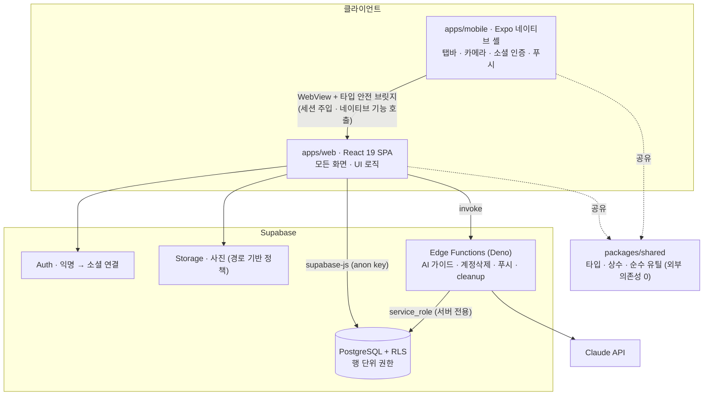
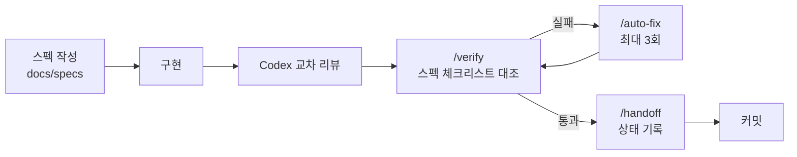
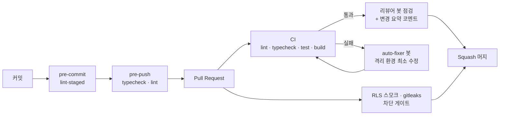

# 이사콕 — 이사일정관리 앱

> 이사일만 입력하면 할 일을 자동으로 일정에 배치하고, 집 상태를 사진으로 기록·보관하는 하이브리드 앱

웹(React) + Expo 네이티브 셸 하이브리드 구조, 백엔드는 Supabase. AI 에이전트 기반 1인 개발 — 설계·판단·검증은 직접 주도, 구현은 AI로 가속 + 다른 모델로 교차 리뷰.

App Store · Google Play(출시 준비 중)

## 프로젝트 요약

- 기획부터 출시 준비까지 전 기능 구현 완료 — Vercel(웹) 배포 · EAS로 iOS·Android 빌드. iOS 실기기 검증 완료, Android 내부 테스트 통과 (양 스토어 프로덕션 출시만 남음)
- 단계마다 스펙 먼저 작성 → 구현 → 검증하는 [SDD](docs/specs) 방식
- 설계 판단은 그때그때 [ADR](docs/ADR.md)로 기록
- 리뷰·자동 수정용 CI 파이프라인 직접 구성
- RLS(행 단위 권한) 기반 보안 설계

## 스크린샷

준비 중

<!--  -->
<!--  -->
<!--  -->

## 문제

이사 준비는 챙길 게 많은데 "지금 뭘 해야 하는지"는 흩어져 있음. 전입신고·관리비 정산·인터넷 이전 신청 시점을 매번 따로 검색해야 함.

→ 이사일 하나로 할 일을 D-day 기준 자동 배치. 이사일이 다가오거나 미뤄지면 급한 정도에 맞춰 일정 그룹을 다시 묶음. 이사 전후 집 상태는 촬영 시각(EXIF)·파일 해시와 함께 기록해 보증금 분쟁 증거로 보관.

대상은 세입자 이사 시나리오. 기획 배경은 [docs/project-overview.md](docs/project-overview.md).

## 주요 기능

- **온보딩** — 이사일·주거유형·계약유형·첫 이사 여부 4단계 입력 → 조건에 맞는 체크리스트를 한 번에 생성
- **대시보드 / 타임라인** — 오늘 할 일과 전체 일정을 분리해 표시
- **체크리스트** — 낙관적 토글, 메모 디바운스 자동 저장 (in-flight 직렬화로 빠른 편집 시 누락 방지)
- **스마트 재배치** — 이사일까지 남은 기간 기준 5개 모드로 일정 재구성
- **집 상태 기록** — 방별 사진, 업로드 전 리사이즈·압축, EXIF·SHA-256 보관, 휴지통/복원
- **AI 맞춤 가이드** — Edge Function에서 Claude 호출 + 결과 캐싱
- **소셜 로그인** — 카카오·구글·애플, 익명으로 먼저 쓰고 나중에 계정 연결
- **푸시 알림** — 매일 아침 할 일 요약 + D-7 / D-3 / D-1 / D-day 마일스톤 (Cron 발송)
- **계정 삭제 / 약관** — 삭제 시 애플 토큰 해제까지 서버에서 처리

## 기술 스택

| 영역             | 사용                                                                  |
| ---------------- | --------------------------------------------------------------------- |
| 웹               | React 19 · TypeScript 5.9 · Vite 6 · Tailwind CSS v4 · React Router 7 |
| 상태             | TanStack Query 5 (서버) · Zustand 5 (UI)                              |
| 네이티브 셸      | Expo SDK 55 · React Native 0.83 · Expo Router · react-native-webview  |
| 백엔드           | Supabase — PostgreSQL + RLS + Auth + Storage + Deno Edge Functions    |
| AI / 관측 / 알림 | Claude API · Sentry · PostHog · Expo Push                             |
| 도구             | Turborepo · pnpm · Vitest · GitHub Actions                            |

## 아키텍처



- 화면 로직은 전부 웹앱. 네이티브 셸은 그 웹을 WebView로 띄우며 카메라·푸시·소셜 로그인·세션 저장만 담당. 둘 사이는 타입 안전 브릿지 메시지로 통신 (배경: ADR-001/002 → [docs/ADR.md](docs/ADR.md))
- 키 분리 — 클라이언트는 anon key만 쓰고 RLS 범위 안에서만 접근, service_role 키는 Edge Function 전용

## 설계 원칙

**스펙 우선** — 매 단계 [docs/specs/](docs/specs)에 만들 것을 먼저 정의하고 구현, 끝나면 verify 리포트로 코드와 대조.

**ADR로 판단 기록** — 고민이 갈렸던 지점마다 선택·이유·포기한 것을 남김 ([docs/ADR.md](docs/ADR.md)). 예를 들면

- `ADR-021` — AI 모델 Sonnet → Haiku. 가이드 재작성엔 품질 충분, 비용 약 75%↓·응답 단축
- `ADR-042` — 익명 로그인 우선 후 소셜 연결로 가입 장벽 제거
- `ADR-075` — Free 티어 제약으로 dev=prod 통합, 대신 분리 트리거를 함께 명시

**보안 우선** — 전 테이블 RLS, 클라이언트 anon key만, 센 키는 Edge Function 전용, Sentry/PostHog로 나가는 데이터에서 개인정보(주소·메모) 스크럽, 레이트 리밋은 별도 RPC.

테스트는 날짜 계산·진척도·해시·긴박도 판정 같은 순수 로직 위주 (Vitest, shared 21 + web 15 케이스). 화면 컴포넌트 커버리지는 아직 부족 — 더 채워야 할 부분.

## 개발 인프라 — 커스텀 하네스

1인 프로젝트지만 협업 환경을 가정하고, 커밋부터 머지까지 품질 게이트를 둠. 기반은 스펙 우선 개발(SDD) — 스펙이 먼저고, 코드가 스펙대로 갔는지는 자동 검증과 리뷰 봇이 함께 점검.

**한 단계 개발 흐름** — 매 단계 스펙(`docs/specs/`)을 구현 전에 먼저 쓰고, 그게 구현·검증의 기준. 이 흐름을 커맨드로 정리.



- `/verify` — 스펙 대비 구현 검증 (빌드·린트·테스트 + 스펙의 완료 체크리스트 대조)
- `/handoff` — 진행 상태를 `docs/STATUS.md`에 기록 (다음 세션이 한눈에 이어받게)
- `/auto-fix` — 검증이 깨지면 격리 컨텍스트에서 최대 3회 자동 수정·재시도

리뷰는 **Codex로 먼저 교차검증** 후 `/verify`로 스펙 대조 — 구현을 Claude로 했으니 같은 모델이 자기 코드를 검수하는 편향을 피하려는 것. Codex가 잡은 P1/P2 지적·수정은 verify 리포트에 보존.

스펙은 지우지 않고 변경 이력으로 보존(단계별 verify 리포트와 함께). 구현이 스펙과 어긋났는지는 `/verify` 체크리스트와 PR의 spec-reviewer가 다시 대조 — 스펙대로 갔는지를 기억이 아니라 파이프라인에서 확인.

**커밋이 머지되기까지** — 로컬 pre-commit(스테이징분 lint-staged) → pre-push(전체 typecheck·lint) → 원격 CI(통과해야 머지). 커밋 메시지는 commitlint로 Conventional Commits 형식 검사.



**GitHub Actions 워크플로**

| 워크플로           | 역할                                             |
| ------------------ | ------------------------------------------------ |
| `ci.yml`           | lint · typecheck · test · build (머지 차단)      |
| `auto-fix-bot.yml` | CI 실패 시 봇이 격리 환경에서 최소 수정 시도     |
| `pr-summarize.yml` | CI 통과 후 변경 요약 코멘트 자동 게시            |
| `rls-ci.yml`       | RLS 읽기/쓰기 시나리오 스모크 테스트 (머지 차단) |
| `gitleaks.yml`     | 시크릿 노출 스캔                                 |
| `db-backup.yml`    | 매일 03:00 KST DB 백업                           |

**리뷰 서브에이전트** — PR이 올라오면 영역을 나눠 점검. 스펙 일치(spec-reviewer), 민감정보·RLS·인증 흐름(security-auditor), 웹/네이티브 접근성(web · native-a11y-reviewer), loading·empty·error·success 4상태(ux-state-reviewer), 번들·렌더 성능(perf-budget-reviewer), 변경 요약(pr-summarizer), 자동 수정(auto-fixer). 정적 분석(ESLint·Gitleaks)이 놓치는 의미·흐름 단위를 담당.

**자동 수정 안전장치** — auto-fixer는 최소 변경만 하고, 건드리면 안 되는 영역(테스트·마이그레이션·인증·시크릿·CI 설정)은 정책 파일(`.claude/policies/`)로 차단. 여기에 fork·작성자 확인, 변경 범위 가드, 재시도 횟수 제한, dry-run 모드까지 다층 방어 (`ADR-032`).

**가드레일 — 어디까지 자동화할지** — 자동 머지는 두지 않음. 봇은 제안·수정까지만, 머지는 사람이 결정(`ADR-031`). 범위·시크릿 차단 같은 결정적 가드는 코드(`scripts/auto-fix/`)로, 의미·흐름 판단은 에이전트 담당(`ADR-024`). 테스트 자동 생성처럼 사람 판단이 필요한 건 일부러 자동화 제외(`ADR-027`).

핵심은 AI를 코딩 보조로만 쓰지 않고, 리뷰와 자기 수정을 자동화하는 파이프라인 자체를 설계한 것.

## 구조

```
CLAUDE.md               레이어·의존 규칙·컨벤션 문서화 (루트 + 패키지마다)
apps/
  web/                  React + Vite 웹앱 (모든 화면 로직)
    src/features/       기능별 모듈 — onboarding · dashboard · timeline · checklist-detail · photos · ai-guide · settings (각 feature = components/ + hooks/)
    src/services/       Supabase 호출 계층 (UI 로직과 분리)
    src/stores/         Zustand UI 상태
    src/shared/         공통 컴포넌트·유틸
  mobile/               Expo 네이티브 셸 (WebView 래핑 + 네이티브 인증/푸시)
packages/shared/        타입·상수·순수 유틸 (앱 간 공유, 외부 의존성 0)
supabase/               DB 마이그레이션·시드·Edge Functions
docs/                   기획 문서·단계별 스펙(SDD)·설계 기록(ADR)
.claude/                CI 보조 에이전트·정책·커맨드
```

**feature 폴더 구조** — 한 기능의 화면·훅·로직을 한 폴더에 모아, 작업 범위가 한 폴더 안에서 끝남.

**context engineering** — 패키지마다 `CLAUDE.md`에 레이어·의존 방향·컨벤션을 문서화. 온보딩 문서이자 코딩 에이전트에 주는 컨텍스트로, 작업 규칙의 단일 기준.

## 실행

```bash
pnpm install
pnpm dev        # 웹 개발 서버
pnpm verify     # lint + typecheck + test + build (CI와 동일 게이트)
```

환경 변수는 `.env.example` 복사 후 `VITE_SUPABASE_URL` · `VITE_SUPABASE_ANON_KEY`만 채우면 됨 (나머지는 비우면 해당 기능만 꺼짐, 실제 키는 미포함). 모바일은 셸이 웹에 세션을 주입하는 구조라 브라우저 단독 실행과 절차가 달라 별도 — [apps/mobile/CLAUDE.md](apps/mobile/CLAUDE.md).

## 문서

- [docs/ADR.md](docs/ADR.md) — 설계 판단 기록
- [docs/TROUBLESHOOTING.md](docs/TROUBLESHOOTING.md) — 트러블슈팅 노트 (교차 리뷰로 발견한 이슈의 원인·해결 정리)
- [docs/specs/](docs/specs) — 단계별 스펙
- [docs/STATUS.md](docs/STATUS.md) — 진행 상태
- [docs/DESIGN.md](docs/DESIGN.md) — 디자인 시스템

## 라이선스

Apache License 2.0 — [LICENSE](LICENSE)
